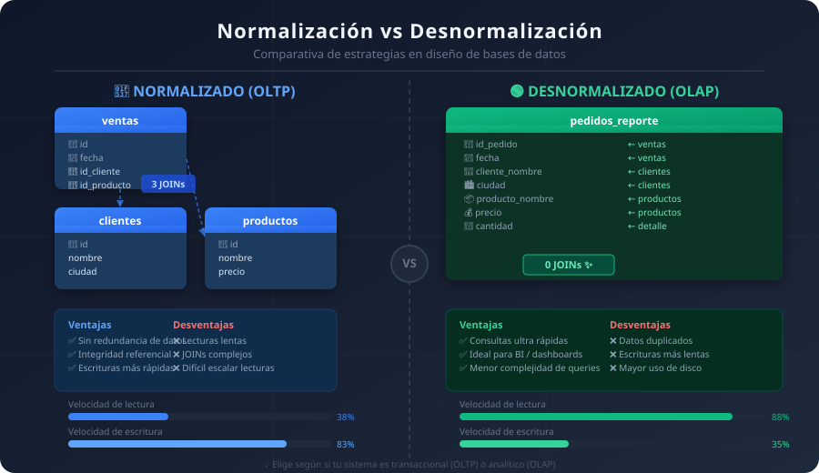

# 📊 Desnormalización en Bases de Datos

<p align="center">
  
</p>

<p align="center">
  
  
  
</p>

---

## 📌 ¿Qué es la desnormalización?

La **desnormalización** es una técnica de diseño de bases de datos en la que se rompe intencionalmente alguna de las formas normales (1NF, 2NF, 3NF o BCNF) con el objetivo de **mejorar el rendimiento de las consultas**.

A diferencia de la normalización (que busca eliminar redundancia), la desnormalización **introduce redundancia controlada** para optimizar la lectura de datos.

---

## 🔄 Comparativa: Normalización vs Desnormalización

<p align="center">
  
</p>

---

## 🎯 ¿Cuándo se usa?

Se utiliza principalmente cuando:

- Se prioriza la **velocidad de lectura** sobre la escritura  
- Se manejan grandes volúmenes de datos  
- Se construyen sistemas de análisis (BI, dashboards)  

---

## 🧪 Caso práctico: Sistema de Reporting (Data Warehouse)

En sistemas analíticos (OLAP), como dashboards empresariales, es común aplicar desnormalización.

---

### 🔹 Esquema normalizado (OLTP)

Tablas:

- `ventas(id, fecha, id_cliente, id_producto)`
- `clientes(id, nombre, ciudad)`
- `productos(id, nombre, precio)`

Consulta:

```sql
SELECT v.fecha, c.nombre, p.nombre, p.precio
FROM ventas v
JOIN clientes c ON v.id_cliente = c.id
JOIN productos p ON v.id_producto = p.id;
```

---

## 🛒 Caso práctico: Sistema de tienda (E-commerce)

### 🔹 Escenario

Una tienda en línea necesita mostrar rápidamente información de pedidos en su panel de administración.

---

## 🧩 Diseño NORMALIZADO (OLTP)

Tablas separadas:

- `clientes(id, nombre, ciudad)`
- `productos(id, nombre, precio)`
- `pedidos(id, fecha, id_cliente)`
- `detalle_pedido(id_pedido, id_producto, cantidad)`

### Consulta necesaria

```sql
SELECT p.id, p.fecha, c.nombre, pr.nombre, pr.precio, dp.cantidad
FROM pedidos p
JOIN clientes c ON p.id_cliente = c.id
JOIN detalle_pedido dp ON dp.id_pedido = p.id
JOIN productos pr ON dp.id_producto = pr.id;
```

---

## ⚡ Diseño DESNORMALIZADO (OLAP)

Tabla única:

- `pedidos_reporte(id_pedido, fecha, cliente_nombre, ciudad, producto_nombre, precio, cantidad)`

### Consulta necesaria

```sql
SELECT *
FROM pedidos_reporte;
```
